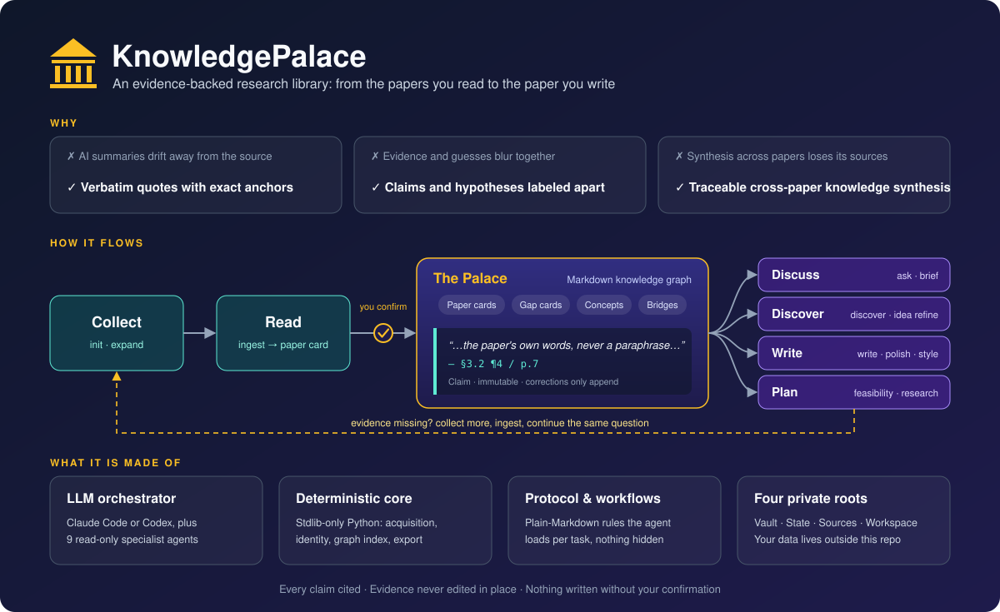

> Current task routes: [Commands](knowledge_palace/protocol/COMMANDS.md). Selected literature is ingested; reading updates its card. `write` and `polish` share manuscript analysis; `feasibility` assesses a design. Direct manuscript tasks need no new project.

# KnowledgePalace

English | [中文](README.zh-CN.md)



An evidence-driven research knowledge OS. An LLM orchestrator (Claude Code or
Codex) plus a deterministic, stdlib-only Python core turn the papers you read
into a human-readable markdown knowledge graph — where Claims retain verbatim
quotes and anchors, interpretations declare their sources, counts are computed live rather than
cached, and nothing is written without your explicit confirmation.

You talk to it in natural language or with `/palace` commands. Library answers
cite the Claims they rest on; background explanation, hypotheses and your own
observations are labeled as such; and when more literature would change an
answer, Palace collects it, ingests what you select, and continues.

## What it does

**Build an evidence base**

- **Collect and read papers** (`/palace init`, `/palace expand`, `/palace ingest`)
  — every selected paper is read and becomes a *paper card*: verbatim claims with
  anchors (`— §sec [¶para] / p.page`), the author's argument and study
  conditions, an optional analysis-evidence table, dated reading notes, concept
  tags on 7 axes and bibliographic context. Reading an existing paper again
  deepens its card; old Claims keep their quotes and anchors. An abstract-only
  source gets a card that says so (`source_coverage`, `read_depth`), never
  invented findings.
- **Track research gaps** — gap cards accumulate Claim-linked relations
  (`identifies / supports / partially_addresses / disputes / reframes`) as
  papers arrive; status changes explain study design, conditions, dependencies
  and the subquestions advanced. Synthesis records its evidence dependencies.
- **Bounded literature expansion** (`/palace expand`) — A→B→C citation
  traversal with explicit depth (≤2) and budget caps, scope-bound
  select/defer/reject decisions, and resumable checkpoints. Never an
  unbounded crawl.
- **Multi-domain by design** (`/palace domain add`) — per-domain concept
  subtrees over shared abstraction axes; between top-level domains there are
  only typed bridges, never hierarchy.

**Consult it**

- **Discussion** (`/palace ask`) — explanation, comparison and multi-turn
  research discussion. Library-backed statements cite their Claims; background
  explanation, system hypotheses and your observations stay distinguishable and
  are never dressed up as literature. When more evidence would change the
  answer, `init`/`expand` collect it, the selected papers are ingested, and the
  same question continues. On request the outcome is kept in the project's
  research notes.
- **Briefs** (`/palace brief`) — seven dated views: `onboard`
  (domain map + reading path), `map <concept>` (method timeline +
  disputes), `progress <topic>` (questions, advances and remaining evidence),
  `gaps`, `ideas` (gap × transfer opportunity cards),
  `transfers`, `bridges` (domain-pair connection report).
- **Cross-domain discovery** (`/palace discover`) — evidence-backed transfer
  candidates across shared pattern/function/failure-mode axes, each with
  non-stopword bridges and a first validation experiment.
- **Idea refinement** (`/palace idea refine`) — your idea, critiqued against
  the vault: supporting/opposing/unknown evidence side by side, closest prior
  work, falsifiers, and a minimal validation experiment. Novelty verdicts are
  profile-bound and vault-relative — never absolute claims.

**Write with it**

- **Write and polish** (`/palace write`, `/palace polish`) — both start from a
  shared *manuscript analysis*: research question, central claim and evidence,
  argument and section roles, terminology, your writing intent. `write` drafts,
  outlines or substantially revises from selected evidence and your materials;
  `polish` improves only the requested passage and keeps the rest — including
  the scientific claims — unchanged. Direct text needs no project; project mode
  keeps append-only `rNNN.md` revisions. Results are never fabricated.
- **Feasibility** (`/palace feasibility`) — judges whether a design can answer
  its question and be executed with the data, resources and time you actually
  have: 可执行 / 满足明确条件后可执行 / 需调整方案 / 目前无法判断, with the
  decisive conditions and the smallest useful pilot.
- **Research notes** (`/palace research`, `/palace updates`) — per-project
  questions, working definitions, decisions, constraints and material-linked
  observations; `updates` lists judgments whose evidence changed and records
  your review.
- **Style library** (`/palace style`) — 7-dimension style feature cards from
  papers you admire, crystallized into journal/language profiles that bind
  drafting.
- **Introductions** (`/palace draft intro`) — the write workflow's
  introduction route.

**Keep it healthy**

- **Governance and audit** (`/palace govern`, `/palace audit`) — live
  grep-computed trigger scans, concept promotion proposals with impact
  lists, adversarial anchor/provenance review. All edits confirm-first.
- **Offline graph viewer** (`/palace viewer export`) — one self-contained
  HTML file (zero dependencies, zero network) for read-only browsing of the
  domain → concept → work/gap graph.


**Research continuity** — current topic syntheses guide the next bounded reading
set. Unresolved evidence reviews persist across index rebuilds and reach transfer
hypotheses, project arguments and declared section dependencies. Project research
notebooks keep learning goals, decisions and material-linked observations;
selected external style profiles are read in place. See
[the evidence workflow](knowledge_palace/protocol/EVIDENCE.md).

## Design guarantees

- **Four private roots, outside this repo** — Vault (confirmed knowledge),
  Derived State (rebuildable caches), Source Cache (immutable full texts),
  Workspace (writing projects). Your data never lives in the Framework and
  Palace never runs Git against it.
- **Confirm-before-write** — subagents are read-only; the orchestrator
  packages every change into one confirmation and writes only what you
  approve. Rejection changes nothing, byte-for-byte.
- **Evidence is immutable** — quotes are never edited in place; a misreading
  appends a correction, a wrong-source quote is retracted in place. Both
  preserve the original.
- **Network only inside a task that needs it** — collection, acquisition and
  requested external research may use providers or browsing within their
  scope; `refresh` updates bibliographic data; `govern` reports stale data and
  never fetches.
- **No numeric scoring theater** — weights are qualitative bands, minority
  evidence is displayed next to majority evidence, and support counts are
  grep-computed live, never cached as authority.

## Quick start

Requirements: Python ≥ 3.9 (standard library only — no pip install), and
Claude Code (or Codex; both runtimes share the same core).

```bash
git clone <this-repo> KnowledgePalace
cd KnowledgePalace

# 1. Create the four private roots OUTSIDE the repo worktree
mkdir -p ../KnowledgePalace-vault ../KnowledgePalace-state \
         ../KnowledgePalace-sources ../KnowledgePalace-workspace

# 2. Point Palace at them (paths resolve relative to the config file)
cp .palace.example.toml .palace.toml   # edit if you chose other locations

# 3. Verify the setup — prints the four resolved roots, errors if any is missing
python3 -m knowledge_palace.tools.config_resolver
```

Then open Claude Code in the repo root and start talking:

```
/palace init transformer-interpretability 30   # bootstrap: search → you circle → batch ingest
/palace ingest 10.1038/s41586-021-03819-2      # or ingest one paper by DOI/path
/palace status                                 # live counts + consistency, no writes
/palace ask what limits sample efficiency here?
/palace brief gaps                             # ranked open problems
/palace viewer export                          # offline HTML graph browser
```

Every flow ends in one packaged confirmation before anything is written.

### Using Codex

Run `codex` in the repo root. Codex reads `AGENTS.md` (identical to `CLAUDE.md`),
discovers the skill at `.agents/skills/palace/` and the nine read-only subagents
under `.codex/agents/`; nothing needs installing.

- Codex has no per-skill slash commands. Write `$palace` where the examples say
  `/palace` (`$palace status`, `$palace ingest <DOI>`), or pick it from `/skills`.
- Natural language works the same way: "ingest this DOI", "what limits sample
  efficiency here?" are routed by `AGENTS.md`.
- Commands, workflows, confirmations and the four private roots are shared with
  Claude Code, so both runtimes can work on the same library.

## Command surface

The authoritative table is [COMMANDS.md](knowledge_palace/protocol/COMMANDS.md).

| Command | Purpose |
|---|---|
| `/palace init <topic> [n]` | build or extend a topic collection; selected papers are ingested |
| `/palace expand <target>` | follow references/related work from papers, a question or an evidence hole; selected papers are ingested |
| `/palace ingest [<paths\|dois\|slugs>...]` | read papers and create or update their cards |
| `/palace ask <question>` | explanation, comparison and continuing research discussion |
| `/palace brief <view> [<arg>]` | onboard · map · progress · gaps · ideas · transfers · bridges |
| `/palace discover [<target>]` | cross-domain transfer scouting |
| `/palace idea refine <text\|file>` | develop a research idea, its contribution and validation |
| `/palace research <project>` | maintain project questions, decisions, constraints and observations |
| `/palace write <project\|materials> [<section>]` | draft, outline or substantially revise prose |
| `/palace polish <text\|file\|project>` | improve supplied text after understanding the manuscript |
| `/palace feasibility <idea\|file\|project>` | judge whether a design can answer the question and be executed |
| `/palace draft intro <topic>` | write, introduction section |
| `/palace updates` · `updates resolve <node> <entry>` | judgments awaiting evidence review · record a review |
| `/palace status` | library counts and operational state |
| `/palace audit [<card>...]` · `govern` | evidence review of cards · library maintenance proposals |
| `/palace refresh <impact\|citations\|metadata> [<scope>]` | refresh bibliographic information |
| `/palace domain add <name>` · `list` | register / list domains |
| `/palace style <ingest\|status\|crystallize>` | build the writing-style library |
| `/palace viewer export [<path>]` · `wiki export [<dir>]` | offline HTML view · generated Obsidian hubs |

## Learn more

- **[GUIDE.md](GUIDE.md)** — architecture, repository layout, data model, and
  a detailed command reference.
- **[TUTORIAL.md](TUTORIAL.md)** — hands-on walkthroughs, from empty setup to
  writing a paper section.
- **[PALACE.md](PALACE.md)** — public policy: concept axes, weight bands,
  thresholds, governance triggers.
- **[CONTEXT.md](CONTEXT.md)** — the ubiquitous language (every domain term,
  defined).
- **`knowledge_palace/protocol/`** — the platform-neutral protocol:
  [PROTOCOL.md](knowledge_palace/protocol/PROTOCOL.md) (rules),
  [COMMANDS.md](knowledge_palace/protocol/COMMANDS.md) (command index),
  [EVIDENCE.md](knowledge_palace/protocol/EVIDENCE.md) (evidence tables),
  [GRAPH_QUERY_PORT.md](knowledge_palace/protocol/GRAPH_QUERY_PORT.md) (query
  contract).
- **`knowledge_palace/workflows/`** — the task workflows the agent reads:
  collection, ingest, discussion, manuscript analysis, writing/polishing,
  feasibility.
