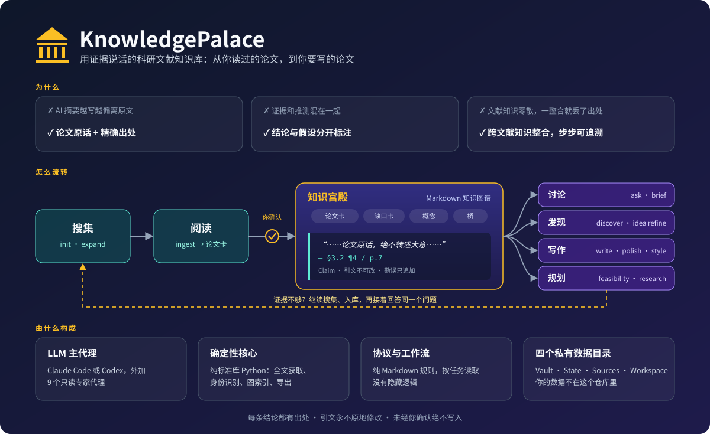

# KnowledgePalace

[English](README.md) | 中文



一句话：这是一个**用证据说话的科研文献知识库**。你在 Claude Code（或
Codex）里跟它对话，它帮你把读过的论文整理成一套 Markdown 知识库，并在
这套库上回答问题、找研究方向、辅助写论文。

它有三条最基本的脾气：

- **每条结论都有出处**——库里存的不是"大意"，而是论文原话，外加精确
  位置（第几节、第几段、第几页）。没有出处的话，它不存也不说。
- **证据和推测分开说**——有论文原话支持的结论标明来源；背景解释、系统
  推测和你自己的观察各自标明身份，不冒充文献结论。证据不够又值得补时，
  它会去搜集、把你选定的论文入库，再接着讨论。
- **写任何东西前先问你**——所有写入操作都会先打包展示给你确认，你说
  "不"，一个字都不会动。

## 它能干什么

**攒文献**

- **搜集与阅读论文**（`/palace init`、`/palace expand`、`/palace ingest`）
  ——每篇选定的论文都会被阅读并生成一张"论文卡"：原文引句 + 出处、作者
  论证与研究条件、可选的分析证据表、带日期的阅读笔记、概念标签和书目
  背景。再次阅读已有论文只会加深原卡，旧 Claim 的引文和出处一字不动。
  只有摘要的论文，卡片会写明材料范围（`source_coverage`、`read_depth`），
  绝不编造正文内容。
- **记研究缺口**——论文越读越多，每个缺口（gap）下面会攒出一张关系表：
  谁提出的、谁部分解决了、谁有异议，关系连接到具体 Claim。改缺口状态
  要说明研究设计、适用条件、证据依赖和推进的子问题；综合记录来源依赖。
- **顺着引用扩展文献**（`/palace expand`）——沿引用关系往外找新论文，
  但深度最多 2 层、数量有上限，选或不选每篇都有记录。不会失控乱爬。
- **多领域共存**（`/palace domain add`）——每个领域有自己的概念树，
  领域之间只通过"桥"相连（共享的抽象概念、迁移卡），不允许一个领域
  当另一个领域的上级。

**问它问题**

- **科研讨论**（`/palace ask`）——解释、比较和多轮讨论。有文献支持的
  陈述引用对应 Claim；背景解释、系统假设和你的观察分开标明，不冒充
  文献。需要补文献且你允许时，它会调用 init/expand 搜集、把选定论文
  入库，再接着回答同一个问题。你说"记下来"，结论就进项目的研究笔记。
- **简报**（`/palace brief`）——七种视图：`onboard`（领域入门地图 +
  推荐阅读顺序）、`map`（某个概念的方法演进时间线）、`progress <topic>`
  （问题演进、已有推进、剩余问题与证据覆盖）、`gaps`（开放
  问题排行）、`ideas`（研究机会卡）、`transfers`（跨领域迁移雷达）、
  `bridges`（两个领域之间有哪些联系）。
- **跨领域找灵感**（`/palace discover`）——在不同领域之间找"这个方法
  也许能搬过来用"的迁移候选，每个候选都要有实打实的桥接概念和一个
  能先做的验证实验。泛泛的"都用了深度学习"不算桥。
- **打磨你的想法**（`/palace idea refine`）——把你的 idea 丢给它，它用
  库里的证据帮你审：哪些证据支持、哪些反对、最像的前人工作是谁、怎么
  证伪、最小验证实验是什么。它只说"相对这个库新不新"，不吹"全世界
  首创"。

**帮你写东西**

- **写作与润色**（`/palace write`、`/palace polish`）——两者都先做一份
  共用的"论文分析"：研究问题、核心主张与证据、全文论证和章节职责、
  术语、你的写作意图。`write` 根据选定证据和你的材料起草、搭大纲或实质
  重写；`polish` 只改你指定的段落，其余内容和科学主张保持不变。直接
  给文本不需要建项目；项目模式下修订版只追加（`rNNN.md`）。**结果绝不
  编造**。
- **实验可行性**（`/palace feasibility`）——根据你实际拥有的数据、资源
  和时间，判断一个方案能否回答问题、能否执行：可执行 / 满足明确条件后
  可执行 / 需调整方案 / 目前无法判断，并给出决定性条件和最小验证试验。
- **研究笔记**（`/palace research`、`/palace updates`）——每个项目的问题、
  工作定义、决策、约束和有材料来源的观察；`updates` 列出证据变化后
  需要复核的判断，并记录你的复核结论。
- **学文风**（`/palace style`）——把你喜欢的论文的写作风格拆成特征卡，
  攒多了结晶成"某期刊风格"档案，写作时可以套用。
- **起草引言**（`/palace draft intro`）——就是 write 的引言流程。

**日常维护**

- **治理和审计**（`/palace govern`、`/palace audit`）——定期体检：哪些
  概念该转正、哪些权重该更新、有没有卡片引用了不存在的标签。所有修改
  同样先列清单再经你确认。
- **离线图谱浏览器**（`/palace viewer export`）——导出一个 HTML 文件，
  浏览器直接打开就能浏览整个知识图谱。零依赖、零联网。


**持续研究**——已有主题综合参与下一次有界阅读；未处理的证据审核事项在索引
维护后保留，并关联迁移假设、项目论证和声明了证据依赖的章节。项目研究笔记
保存学习目标、研究决策和有材料来源的观察；指定的外部文风档案直接读取。
详见[证据工作流](knowledge_palace/protocol/EVIDENCE.md)。

## 几条底线

- **你的数据不在这个仓库里。** 论文卡、全文、写作项目放在四个独立目录
  （详见 GUIDE），本仓库只有"程序和规则"。Palace 也绝不对你的数据目录
  执行任何 Git 操作。
- **先确认后写入。** 干活的子代理全部只读；只有主代理能写，且只写你
  批准的内容。
- **引文永不改动。** 发现错误就追加勘误并保留原文，绝不原地改。
- **联网只为当前任务。** 搜集、获取全文和你要求的外部检索可以在任务
  范围内联网；`refresh` 只更新书目信息；`govern` 只报告、不抓取。
- **不搞假精确。** 权重只分高/中/低档，不算什么综合得分；少数派证据
  永远和主流证据摆在一起给你看。

## 快速上手

需要：Python ≥ 3.9（纯标准库，什么都不用装）+ Claude Code（或 Codex）。

```bash
git clone <this-repo> KnowledgePalace
cd KnowledgePalace

# 1. 在仓库外面建四个数据目录
mkdir -p ../KnowledgePalace-vault ../KnowledgePalace-state \
         ../KnowledgePalace-sources ../KnowledgePalace-workspace

# 2. 复制配置（路径相对于配置文件本身；按上面建的目录默认值直接可用）
cp .palace.example.toml .palace.toml

# 3. 验证配置——打印四个目录的解析结果，缺目录或重复会报错
python3 -m knowledge_palace.tools.config_resolver
```

然后在仓库根目录打开 Claude Code，直接开聊：

```
/palace init transformer-interpretability 30   # 建库：搜论文 → 你勾选 → 批量收录
/palace ingest 10.1038/s41586-021-03819-2      # 或者按 DOI 收单篇
/palace status                                 # 看看库里有什么
/palace ask what limits sample efficiency here?
/palace brief gaps                             # 开放问题排行
/palace viewer export                          # 导出离线图谱浏览器
```

### 在 Codex 里用

在仓库根目录运行 `codex` 即可。Codex 会读取 `AGENTS.md`（与 `CLAUDE.md` 内容
一致），自动发现 `.agents/skills/palace/` 里的 skill 和 `.codex/agents/` 下的
九个只读子代理，不需要额外安装。

- Codex 没有单个 skill 的斜杠命令。示例里的 `/palace` 换成 `$palace`
  （如 `$palace status`、`$palace ingest <DOI>`），或者从 `/skills` 里选。
- 直接说自然语言也一样："收录这个 DOI"、"这里样本效率受什么限制？"会由
  `AGENTS.md` 路由到对应流程。
- 命令、工作流、写入前确认和四个数据目录与 Claude Code 完全共用，两个
  运行时可以操作同一个库。

## 常用命令

权威命令表见 [COMMANDS.md](knowledge_palace/protocol/COMMANDS.md)。

| 命令 | 干什么 |
|---|---|
| `/palace init <主题> [n]` | 围绕主题建立或补充文献集；选定论文自动入库 |
| `/palace expand <目标>` | 从论文、问题或证据缺口沿引用扩展；选定论文自动入库 |
| `/palace ingest [<路径\|DOI\|slug>...]` | 阅读论文，创建或更新论文卡 |
| `/palace ask <问题>` | 解释、比较和多轮科研讨论 |
| `/palace brief <视图> [<参数>]` | 七种视图：onboard · map · progress · gaps · ideas · transfers · bridges |
| `/palace discover [<目标>]` | 跨领域迁移侦察 |
| `/palace idea refine <文本\|文件>` | 发展你的研究想法、贡献和验证方向 |
| `/palace research <项目>` | 维护项目的问题、决策、约束和观察 |
| `/palace write <项目\|材料> [<章节>]` | 初稿、大纲和实质性重写 |
| `/palace polish <文本\|文件\|项目>` | 理解原稿后优化指定文本 |
| `/palace feasibility <想法\|文件\|项目>` | 判断方案能否回答问题、能否执行 |
| `/palace draft intro <主题>` | write 的引言流程 |
| `/palace updates` · `updates resolve <节点> <条目>` | 待复核的判断 · 记录复核结论 |
| `/palace status` | 库存统计和运行状态 |
| `/palace audit [<卡片>...]` · `govern` | 对照来源复查卡片 · 库内维护提案 |
| `/palace refresh <impact\|citations\|metadata> [<范围>]` | 刷新书目信息 |
| `/palace domain add <名称>` · `list` | 注册 / 列出领域 |
| `/palace style <ingest\|status\|crystallize>` | 建文风库 |
| `/palace viewer export [<路径>]` · `wiki export [<目录>]` | 离线 HTML 视图 · 生成 Obsidian 汇总页 |

## 深入了解

- **[GUIDE.zh-CN.md](GUIDE.zh-CN.md)**——架构、目录结构、数据模型、命令
  详解。
- **[TUTORIAL.zh-CN.md](TUTORIAL.zh-CN.md)**——手把手教程，从装好到写出
  一节论文。
- **[PALACE.md](PALACE.md)**——公开规则：概念轴、权重档、各种阈值。
- **[CONTEXT.md](CONTEXT.md)**——术语表，每个名词的准确定义。
- **`knowledge_palace/protocol/`**——协议正文（约束 AI 行为的规则原文）。
- **`knowledge_palace/workflows/`**——代理按任务读取的工作流：搜集、
  阅读入库、讨论、论文分析、写作/润色、可行性。
